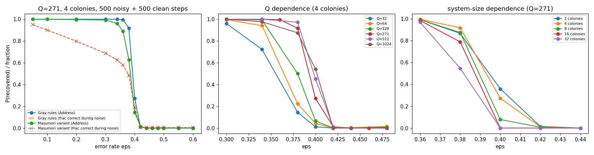

# GacsCA: executable Gács/Gray noise-robust cellular automaton — project report

Last updated: 2026-09-18. Sub-reports: [design_selfsim.md](design_selfsim.md),
[discrepancies.md](discrepancies.md), [level0.md](level0.md).

## 0. Goal and status in one paragraph
Build, verify and experimentally study an executable version of Gács' one-dimensional
fault-tolerant cellular automaton in Gray's simplified presentation, up to finite-depth
hierarchical self-simulation. **Status:** the level-0 automaton (Gray Sec 5.2: Address/Age/Flags
majority repair, the part Masumori et al. implemented) is implemented three ways (literal scalar
spec, vectorized NumPy, CUDA/nanobind), cross-tested, and characterised on the GPU. The
self-simulation machinery is designed ([design_selfsim.md](design_selfsim.md)) and **stage 1 is
implemented and verified** ([selfsim_stage1.md](selfsim_stage1.md)): colonies of 256 cells
simulate level-1 cells (local structure) through timed mail streams, a bit-serial microprogram
computing the level-1 transition, and trickle-down; the decoded level-1 trajectory equals the
direct one; CUDA engine ≈2×10⁹ cell-updates/s. First hierarchy experiments: the induced level-1
error rate scales as ≈QUε² (adjacent-pair channel), and a misaligned-colony island that level-0
rules cannot erode is moved/eroded by trickle-down (glider dynamics, see sub-report).

## 1. Sources and how they relate
- Gács 2001 (J. Stat. Phys. 103) — the full construction: media, block codes, amplifiers, robust
  media, a rule language, and the program (Secs 12–20). Nearest-neighbour, variable cell kinds.
- Gray 2001 — Reader's Guide: a simplified range-5 model with fields Address, Age, Flags,
  SimBit(5), Workspace, Mailbox; Q colony size, U = 128Q; Props 1–5.
- Masumori, Sinapayen, Ikegami 2024 — Java implementation of Gray's local structure only
  (no self-simulation), Q = 271, recovery vs error rate.

## 2. Model (level 0) — implemented
Ring of L = ncol·Q cells, neighbourhood N(x) = {x−5..x+5}. Fields: Address ∈ [0,Q),
Age ∈ [0,U), Flag1, Flag2 (+ Workspace.Flag1/2 read from the simulation structure).
Apparent colony C(x): the position v of x such that ≥3 of the five sites x+i (i=1..5) satisfy
(Address(x+i) − i) mod Q = v. Inconsistency (i)–(iv), Flag1 and Flag2 rules, and the Address/Age
majority votes are transcribed literally in `gacsca/level0_spec.py` (Gray pp. 20–22). Ambiguities
and Masumori's modifications are catalogued in [discrepancies.md](discrepancies.md); the main
finding is that two of Masumori's three "errors in Gray" are not errors (D2, D4).

Noise: each cell independently with probability ε per step is replaced by a uniformly random
state (Address uniform in [0,Q), Age in [0,U), flags uniform) — Gray's ε-perturbation with a
strictly positive ν.

Code: `gacsca/level0_np.py` (NumPy, batch×L), `gacsca/cuda/gacs_cuda.cu` (CUDA, one thread per
cell, hash-based reproducible noise), `gacsca/gpu.py` (torch front-end). Tests: `tests/`
(spec ≡ NumPy ≡ CUDA on random and near-ground configurations; noise statistics).

## 3. Level-0 results (details in [level0.md](level0.md))
- Qualitative reproduction of Masumori Fig. 7A: leftward Flag1 waves confined to colonies; after
  the noise stops, Flag1 clears in a wave from the right end at speed ≈ 2.7 (Gray: ≥ 1.75).
- Recovery threshold (500 noisy steps then 500 clean, Q=271, 4 colonies, 256 trials/point):
  P(Address fully recovered) = 1.00 up to ε = 0.34, 0.92 at 0.38, 0.27 at 0.40, ≈0 at ≥ 0.42.
  Masumori report failure only above ≈0.55–0.6; their noise protocol differs (D7). A corrected
  mean-field recursion c' = (1−ε)[c + (1−c)g(c)], g(c) = P(Bin(5,c) ≥ 3), gives ε_c = 0.334;
  spatial correlation (colony structure) pushes the real threshold up to ≈0.40.
- Q dependence: smaller colonies are less robust (Q=32: threshold ≈0.33; Q ≥ 271: ≈0.40).
  Larger systems fail slightly earlier (more colonies, more chances for one to fail).
- The Masumori rule variant (Flag1 (ii) counting all of R(x)) is slightly less robust.

## 4. Self-simulation design (summary; full text in design_selfsim.md)
Uniform rule; simulated state laid out one bit per cell on the Info track; R-fold redundant
tracks; two timed mail streams retrieve all 10 neighbour colonies (sample MailL at t0+jQ);
three gathering stages with majority; an Age-scheduled microprogram (compiled from a Python
DSL into an op table) computes the simulated transition bit-serially; the same table is used to
interpret the simulated cell's own microstep (self-reference without an interpreter string).
Cost model: level-2 dynamics reachable for O(10–100) steps; level 3 static only.

## 5. Stage-1 results (summary; details in selfsim_stage1.md)
- Block simulation verified (decoded == direct). Work period 8010 steps (U = 8192), K = 210 bits.
- ε₁ ≈ c·QU·ε² (c ≲ 1): the simulation structure survives iid noise only for ε ≲ 3×10⁻⁴; the
  level-0 local structure survives up to 0.40. The hierarchy's benefit is against organised
  islands, which must be injected.
- Misaligned-colony island: fixed point for level-0 rules; with trickle-down it becomes a glider
  (erodes 3 colonies/period on the left, invades 3 on the right) until a level-2 boundary.

## 6. Next concrete steps
1. Island on a 512-colony ring (two level-2 cells): confirm the right end stops at the level-2
   boundary and the island then erodes (running).
2. Stage 2: interpretation of the simulated cell's own microstep (uniform rule), enabling level-1
   cells that simulate level-2 cells; depth-2 encodings and island experiments vs depth.
3. Gray's Flag2 right-end reversal: characterise (fires once per 16 periods) and test islands whose
   right end is not at a level-2 boundary.
4. Burst noise (space-time boxes) → does it create stable islands? lifetime vs depth.
