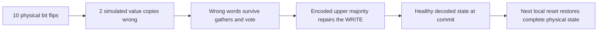

# Exact gather acceleration and targeted simulated-layer repair

2026-09-26. Actual packet transport is now batched alongside independent physical
controller events. Two complete work periods retain the frozen full physical
checkpoints while GPU advance falls to 37.21 s. The guarded nested-window fixture
also passes in 45.02 s of GPU advance. A new repair experiment shows that ten
physical bit flips, arranged as two five-holder clusters, survive lower local
correction but are repaired by the encoded upper procedure. A fifteen-flip,
three-copy control fails as expected. These are targeted initial faults through
one simulation link, not a stochastic noise threshold or complete nested run.

## Communication domain and preserved physical dependencies

New `small_holder_resident_gather.{py,cu}` retains the same physical rule,
alphabet, ROM and local expression as [NESTED_WINDOWS.md](NESTED_WINDOWS.md).
It applies before the first temporal vote, inside the three active gather
phases, without crossing resets or phase/vote boundaries. It preserves the
existing canonical/coherent resident domain and checks stationary Signals.
Each batch is at most 8Q physical ticks, with a bounded packet staging capacity.

The actual controller runs the unchanged local expression at each head event.
Each actual TRANSMIT reads its source Data then and records the resulting packet's
birth time, direction, target, payload and remaining crossings. Existing live
packets enter with birth time zero. No host computation supplies the messages or
any simulated upper transition. Controller free flight/WAIT uses the previously
checked event-skipping relation.

A packet may target only a foreign-neighbor history slot of the fixed ROM layout.
Every actual controller read/write/TRANSMIT access to such a slot is rejected.
This check occurs when the head reaches the operand; flight stops before that
operation. Metadata reads access static metadata and do not consume history Data.
Thus accepted head execution cannot depend on a deferred packet delivery, nor
can a head overwrite its destination. Any rejected interval leaves the committed
Data/controllers/clock unchanged and falls back to synchronous local evolution.

Packet flight uses the exact receive/countdown rules. For a rightward packet
born at Address a with k remaining crossings and target t, its prospective hit
is kQ+t-a steps later, when positive; otherwise it has no hit. Its drop boundary
is kQ+Q-a steps later. The earlier event ends its lifetime. Leftward travel uses
the reflected coordinates Q-1-a and Q-1-t. Live packet positions and remaining
counts are reconstructed at the batch endpoint, including wraparound in small
rings. Packets already delivered or dropped disappear at the exact event time.

Same-track world-line collisions reject the batch rather than silently losing a
message. Because packets have at most seven remaining crossings, candidate
sources lie within seven colonies; small rings are enumerated without duplicate
sources. Accepted deliveries retain their temporal order: the latest write wins,
with the right track winning simultaneous left/right arrivals, as in the local
rule. Packet fields merge with actual head and Signal records at the endpoint.
Data, head/Signal records and packets all stage until every colony accepts.

This batching is a derived physical trajectory shortcut. It does not change the
radius-seven physical rule into a long-range rule. Its correctness obligations
are explicit: exact flight, collision exclusion, receiver order and protected
controller noninterference. Unsafe or over-capacity cases retain the existing
synchronous path. Arbitrary faulty geometry or broken physical replicas still
require the separate full-raw exception backend.

## Tests and packet induction certificate

```sh
OPENBLAS_NUM_THREADS=1 python -m unittest discover -s tests/fixed_rule -p test_small_holder_resident_gather.py -v
# 5 tests, 24.232 s, OK.
OPENBLAS_NUM_THREADS=1 python -m experiments.fixed_rule.prove_small_holder_packet_flight --output figs/fixed_rule/small_holder_packet_flight_proof_v1.json
# 8 hop-count cases, 0.254090 s, 38016 KiB host RSS.
```

Tests compare against synchronous execution and full raw native steps. They
cover both directions; zero, one, three and seven crossings; deliveries/drops;
small-ring wrap and a 17-colony source halo; actual SEND payloads and surviving
mail; latest-arrival and right-track priority; protected read/write rejection;
packet capacity; and same-track collision rejection with exact fallback.
Several cases compare entire coherent core/tail arrays, including active
controllers. Host evaluator/upper-rule calls are forbidden during batch advance.

The BDD certificate proves a one-step induction of packet position, remaining
count, validity and delivery against the receive edge/decrement/hit relation.
For each of eight hop counts it covers all 32768 source Addresses, all 32768
coordinate targets and all 524288 elapsed-time values: 49 independent bits and
20 checked relations per case. The largest case uses 13745 BDD nodes. The
executor's target guard supplies the MEM assumption; coordinate reflection gives
the leftward case. Payload is copied unchanged. This certificate proves flight
arithmetic, not the separate noninterference/collision/order obligations; those
are enforced by the guards and checked against the full local rule in tests.

## Whole-period and nested-window results

```sh
OPENBLAS_NUM_THREADS=1 python -m experiments.fixed_rule.small_holder_gather_two_periods --reference figs/fixed_rule/small_holder_resident_two_periods_v1 --output figs/fixed_rule/small_holder_gather_two_periods_v1
OPENBLAS_NUM_THREADS=1 python -m experiments.fixed_rule.small_holder_gather_nested_windows --output figs/fixed_rule/small_holder_gather_nested_windows_v1
OPENBLAS_NUM_THREADS=1 python -m experiments.fixed_rule.audit_small_holder_gather_nested_windows --input figs/fixed_rule/small_holder_gather_nested_windows_v1 --output figs/fixed_rule/small_holder_gather_nested_windows_audit_v1.json
```

| Two-period fixture | Earlier GPU advance | Gather backend | Total with audits | Host RSS |
|---|---:|---:|---:|---:|
| 15 colonies, all physical checkpoints | 321.373 s synchronous / 133.104 s independent | 37.210 s | 52.387 s | 563896 KiB |
| 62 guarded nested-window colonies | 224.435 s | 45.024 s | 46.913 s | 167592 KiB |

Both execute 8589934592 physical ticks on one resident state. The 15-colony run
checks every decoded raw field and every coherent physical row, including gaps,
at both commits against the frozen audited baseline. Its GPU advance is 8.636828
 times faster than the original synchronous backend. A provenance/accounting
check passed in small_holder_gather_evidence_audit_v1.json.

The 62-colony archive is byte-for-byte identical to the previous nested-window
archive. Independent scalar/native/full-description and true-upper-ring-cone
audit passed in 1.340597 s, with 60572 KiB host RSS. The same scope limits apply:
34 true-ring interior cells agree after one upper physical tick and six after
two; neither the complete Q-squared bottom trajectory nor an upper work period
has been executed.

Sampled process VRAM is 424 MiB for the first fixture and 432 MiB for the second.
Peak explicit buffers are respectively 6331080 and 17395632 bytes. The gather
head kernel reports 214 registers and 48 stack bytes/thread; the mail kernel has
64 registers and zero stack. Both report zero compiler local bytes. Exact binary:
`651e207cf3e899e19fdeddf2af211472a083512a4423cdf7bad1020779b5ece5`.

A separate scaling fixture sends distinct actual payloads, continues live metadata
queries for 8Q ticks, and compares every received payload and controller record:

```sh
OPENBLAS_NUM_THREADS=1 python -m experiments.fixed_rule.small_holder_gather_scaling --output figs/fixed_rule/small_holder_gather_scaling_v1.json
# Passed, 1.288080 s total, 166596 KiB host RSS.
```

At 128 colonies it measured 2.055 ms versus 32.208 ms synchronously; at 257,
3.565 ms versus 60.070 ms. The latter exercises reuse of the 256 worker
workspaces. These are single warm measurements, not full-hierarchy predictions.

## Physical faults corrected by the simulated rule

The active upper fixture has a WRITE of `0x123456789ABCDEF0` at logical Address
107. Five upper holders contain replicas of that controller's value field.
The experiment flips bit zero of two replicas, in upper holders 6 and 8.
Each encoded raw value resides at an actual lower Info address. Flipping that
logical Data bit changes exactly one raw procedure-Data field in each of its
five physical holders. The two clusters therefore contain ten physical one-bit
faults, with no geometry, metadata, clock or other fields changed.

The experiment inspects the full physical states around both clusters and
verifies the exact ten-field fault map. All five lower copies agree on the
wrong word, so lower local majority does not remove the error. It persists after
the first lower tick and into all three gathered histories and the temporal vote.
The encoded upper rule then takes its own five-holder majority and computes the
healthy WRITE. All 154 decoded fields match the healthy reference at commit.



One additional physical reset step is taken in both the damaged world and a
separate healthy checkpoint world. Every core/tail row and every gap row then
agrees: the complete physical states rejoin at U+1=4294967297. The damaged world
is never replaced or reinitialized from the healthy one.

The failure control corrupts three upper replicas, using fifteen physical bit
flips. Their majority is wrong, and the simulated WRITE becomes
`0x123456789ABCDEF1`. Its decoded state differs from the healthy one. This is the
expected behavior outside the two-holder majority guarantee, not a failed run.

```sh
OPENBLAS_NUM_THREADS=1 python -m experiments.fixed_rule.small_holder_cluster_repair --reference figs/fixed_rule/small_holder_resident_two_periods_v1 --output figs/fixed_rule/small_holder_cluster_repair_v1
OPENBLAS_NUM_THREADS=1 python -m experiments.fixed_rule.audit_small_holder_cluster_repair --input figs/fixed_rule/small_holder_cluster_repair_v1 --output figs/fixed_rule/small_holder_cluster_repair_audit_v1.json
```

Both cases passed: 36.404843 s GPU advance, 50.864089 s total, 567360 KiB host RSS.
The independent audit passed in 0.812063 s with 58980 KiB host RSS. It reconstructs
the physical fault map using the independent recursive encoder and checks all
raw decoded outputs against scalar/native/complete-description evaluations.
History persistence and complete physical rejoin are runtime assertions in the
hashed driver; the small saved archive does not itself contain the full lower
physical rejoin snapshots. Artifact SHA256:
`da30580d64b9c8b6956898bc7e80b742deb3cbcb71173b0f88095f0253195660`.

This establishes targeted simulated-layer procedure repair through one link.
It does not establish random-noise robustness, arbitrary geometry/program repair,
a noise threshold, an amplification theorem, or full nested upper work periods.
The candidate-B Flag2 and D10 timing limitations remain unchanged.

## Coordination, ownership and next work

The main agent's requested 8 GiB reservation for the concrete whole-Q allocation
pilot is still pending in STATUS.md; MAIN_AGENT_NOTES.md remains absent. No large
allocation or shared job was launched. Communication is substantially cheaper,
but the U-squared=2^64 horizon still prevents a practical nested macrostep claim.
Next work must address whole-period resource cost/structure, full-ring execution,
finite-depth boundaries and broader fault representations/noise experiments.

Owned additions: small_holder_resident_gather.{py,cu}; its test module;
packet-flight proof; gather two-period, nested-window/audit and scaling drivers;
cluster-repair/audit drivers; this report, STATUS.md, and their private results
and builds under figs/fixed_rule. Frozen sources, shared reports, datasets and
CUDA artifacts are unchanged. All runs exited zero; final GPU query was empty.
The protected historical third-link job was not seen; absence is not completion.
The full fixed-rule goal remains active.
