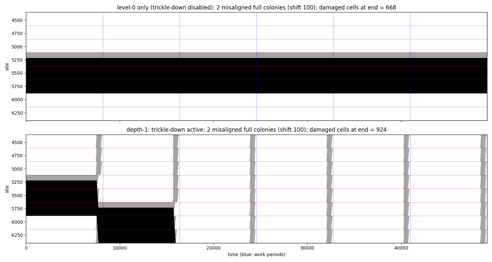

# Stage 1: level-0 colonies simulating level-1 cells (local structure only)

## What is implemented (all in `gacsca/`)
| module | content |
|---|---|
| `microcode.py` | track registry, bit-serial state layout (`Layout`: ADDR, AGE, F1, F2, WF1, WF2 then NT tracks × R copies; K = 30 + 60R bits), op kinds, `Compiler` DSL (const/mov/bitop/shift/sweep/bcast/spread, add_const, eq_const, eq_field, lt_const, or_reduce) |
| `engine_np.py` | reference engine: repair by majority over the R holders, op application per age, redistribution of copies, holder-side wipe rules, Workspace.Flag rules |
| `trlocal.py` | microprogram computing Gray's local-structure transition for a simulated cell from the ARG tracks (apparent colony, inconsistency, Flag1, Flag2, votes) — 847 ops, 1168 steps at reach D=3 (2419 at D=1), 28 temporaries |
| `workperiod.py` | the work period: 3 gathering stages (timed streams, JMAX=6 neighbours each side, majority of 3), compute, F1*/F2* → SimBit at addresses Q−3 / 3, trickle window (2Q), update at age U−1. Length 8010 < U = 8192 |
| `cuda/engine.cuh` | CUDA engine: packed per-copy bit-vector words, op table (CSR by age), each thread evaluates the ops for the R cells whose copies it holds; bit-identical to the NumPy engine (tests) |
| `hierarchy.py`, `build.py` | encode level-1 configurations into colonies, decode, system builder |

Parameters used: Q = 256, U = 8192, R = 3, D = 3, K = 210 bits, Info at addresses [8, 218).

## Verification
1. `tests/test_trlocal.py`: the bit-serial Tr_local equals `level0_spec.step_cell` on random and
   near-colony neighbourhoods (both rule variants).
2. `tests/test_selfsim_stage1.py` and `experiments/stage1_gpu.py`: **decoded level-1 trajectory ==
   direct level-1 trajectory** over several work periods, including repair of deliberately damaged
   level-1 cells by the simulated majority rule. This is the definition of a block simulation
   (Gács Def. 4.19).
3. `tests/test_gpu_engine.py`: CUDA == NumPy for R=3/D=3 and R=5/D=1 across all phases.

Throughput (A100): ≈2×10⁹ cell-updates/s at batch ≥ 64 (0.09 ms per step for 16 384 cells);
one work period of a 256-colony ring (65 536 cells) takes ≈ 0.8 s.

## Induced level-1 error rate (the amplifier relation)
`experiments/stage1_gpu.py`: level-0 noise ε; after each period compare the decoded level-1
state with the direct one-step prediction from the previous decoded state.

| ε | 1e-5 | 3e-5 | 1e-4 | 3e-4 | 1e-3 | 3e-3 |
|---|---|---|---|---|---|---|
| ε₁ per level-1 cell-period | 4e-4 | 1.2e-3 | 4.9e-3 | 3.2e-2 | 0.27 | 0.75 |
| 2QUε² (adjacent-pair estimate) | 4e-4 | 3.8e-3 | 4e-2 | 0.38 | — | — |

A single-hit diagnostic (`experiments/single_hit_diag.py`, one random whole-cell replacement per
work period) never corrupted the level-1 state (0/40). The residual channel is two hits at adjacent
sites in the same step, which defeat the 3-fold majority; hence ε₁ ≈ c·QU·ε² with c ≲ 1 (much
better than Gács's generic (QUε)² bound because only *adjacent* pairs matter). With R = 5 the
channel would be ε³. Consequence: the simulation structure is intact only for ε ≲ 3×10⁻⁴, far
below the level-0 local-structure threshold (0.40). The hierarchy therefore cannot be tested by
"raising iid noise until level 0 fails"; its role is to remove *large organised islands* that the
level-0 rules cannot erode, which iid noise at small ε essentially never creates. Experiments must
inject such islands (Gray's level-k errors) directly.

## Island experiment (`experiments/island_trickle.py`, `island_long.py`)
Two adjacent misaligned full colonies (address 0 at site 20Q+100) inside a 256-colony ring.
- **Level-0 only** (trickle window disabled): the island plus the invaded tail of the next colony
  (668 cells) is a fixed point: its left end (address 0) has no inconsistency, and the Flag1 wave
  from its right end cannot cross the internal colony boundary. This is exactly Gray's "misaligned
  level-1 cell" obstruction (a level-2 error).
- **Depth 1** (trickle-down active): in each trickle window the island's level-1 cells have a
  level-1 inconsistency (their neighbours' data is wiped/offset), F1* trickles down, the island
  erodes from the left at speed ≈1 — but the healthy colonies to its right also carry a level-1
  inconsistency (their level-1 L∩C contains the damaged cells), receive Flag1 too, vote from the
  left, and are invaded. Net effect: a **glider** translating right by 3 colonies per period with a
  trail of 7 colonies whose level-1 state is wiped and re-synthesised by the level-1 majority rule
  (3 cells per period). Gray's argument (p. 38–40) stops the right end at the left boundary of an
  undamaged level-2 cell; a 256-colony ring has a single level-2 cell and no such boundary.
  `island_long.py` repeats the experiment on a 512-colony ring (two level-2 cells): the glider
  travels 3 colonies/period from colony 20 to the level-2 boundary at colony 256, is eroded there
  within two periods, and the level-1 trail heals: **fully repaired (level 0 and level 1) at
  period 80** (6.6×10⁵ steps). With trickle-down disabled the island persists indefinitely.

